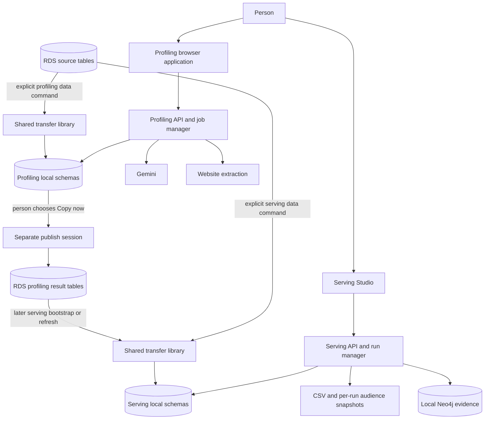
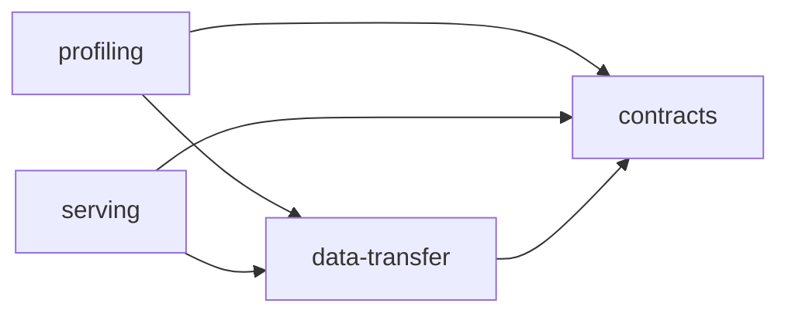

# System architecture

[Guide index](README.md)

## Product and execution model

The system separates website understanding from audience selection. Profiling analyzes websites through three configurable lenses and saves reusable structured attributes and summaries. Serving builds a purchase graph, ranks eligible parent identities for a seller, resolves contact records, and produces exports with evidence.

Both engines are UI-first FastAPI services with command-line entry points. They share a repository and optional full installation, but neither imports, starts, or directly reads the local store of the other. A profiling installation can run without serving or Neo4j; a serving installation can run without the profiling Python package. Their data bridge is an explicitly published RDS table that serving later copies into its own revision.

An arrow into Neo4j means an explicit publication action, not every serving read. The studio can launch serving refresh/rollback through the same engine-owned data functions used by the CLI. Profiling's handoff is another explicit operation, even though its process is the profiling API.

## Package structure

| Distribution | Import root | Responsibility |
|---|---|---|
| `promoter-brain-core-contracts` | `promoter_brain_contracts` | Immutable identifiers, inventory expectations, compatibility, ownership, manifest contract |
| `promoter-brain-core-data-transfer` | `promoter_brain_data_transfer` | Connection boundaries, copy/snapshot mechanics, receipts, local promotion, controlled publication |
| `promoter-brain-core-profiling` | `promoter_brain_profiling` | Website analysis, lenses, registry, jobs, profiling UI, profiling data policy |
| `promoter-brain-core-serving` | `promoter_brain_serving` | Serving revision policy, graph/scoring, exports, evidence, studio |

These arrows mean imports/dependencies. Contracts have no database or orchestration code. Data-transfer has no engine-specific scoring or lens policy. Engines can depend directly on contracts and transfer, but never on each other. The root project is `package = false`: it organizes the workspace and development tooling, rather than providing a fifth runtime package.

Python is constrained to 3.11. There is one root `.venv` and one `uv.lock`. Each package has its own metadata and tests. Profiling adds FastAPI, psycopg pooling, Google GenAI, httpx, trafilatura, tenacity, and fuzzy matching. Serving adds FastAPI, NumPy/SciPy/pandas, psycopg, and Neo4j; its `guard` extra supplies the selector's compatible scikit-learn line.

## Three explicit phases

1. **Setup:** make uv usable, validate host prerequisites, install the chosen package union, prepare configuration, provision local containers, record installed scopes.
2. **Data lifecycle:** inspect RDS compatibility, bootstrap or refresh an engine's local snapshot, verify and promote it; optionally roll back locally.
3. **Operation:** run profiling jobs or serving requests against promoted local data. Website/model APIs remain profiling runtime dependencies. Result handoff and evidence publication require explicit actions.

Setup itself performs no engine workload or data movement. The guided installer can offer a separate, opt-in data step after setup; that step runs the actual data commands and remains subject to the live-access policy.

## Ownership and trust boundaries

| Store or resource | Owner/writer | Readers and use |
|---|---|---|
| Local profiling source/staging/previous/state schemas | Profiling data lifecycle using transfer primitives | Profiling workload readers |
| Local `profiling` workspace results and `profiling_registry` | `profiling/storage.py` | Profiling UI, engines, explicit handoff |
| Local serving staging/active/previous/state schemas | Serving `writer.py`, transfer staging and promotion | Serving runtime and revision checks |
| `serving_evidence` | Serving `evidence.py` | Snapshots and graph publisher |
| Local Neo4j evidence labels | Serving `graph.py` | Studio/status and graph consumers |
| RDS source tables | External system; this project's source sessions are read-only | Explicit engine data commands |
| RDS `profiling` published tables | Profiling handoff through transfer `publish.py` | Subsequent serving transfers and downstream consumers |
| Local JSON, logs, CSV | Respective engine state managers | That engine's UI/CLI |

Single writer means a sanctioned ownership path, not necessarily one physical process. Engine locks, transaction boundaries, role grants, and workspace verification enforce different parts of that rule. The two engines share a PostgreSQL instance, so they remain coupled to its capacity and availability even though their namespaces and code are separate.

## Deployment envelope

This is a developer-local MVP, not a shared authenticated service. Applications and exposed container ports default to loopback. There is no multi-host scheduler, Kubernetes deployment, cross-engine transaction, or automatic continuous synchronization. RDS and Gemini availability are relevant only to the operations that use them. The purchase graph is built in process; Neo4j is an evidence projection, not the scoring engine.

Topics is historical implementation provenance at a pinned revision. It is not imported at runtime. The migration strategy preserved selected proven algorithms while changing package boundaries, storage ownership, configuration, and operator workflows.

## Vocabulary

| Term | Meaning in this project |
|---|---|
| Buyer | A source customer/account record, identified by `buyer_id` or a details-row ID |
| Parent | The consolidated identity used as the graph and serving candidate axis; multiple detail records can share it |
| Seller | A merchant/shop identified by seller ID |
| Lens | A profiling prompt, seed vocabulary, and output schema aimed at one audience dimension |
| Attribute | A model-derived audience label with score/confidence; it is not a purchase edge |
| Vintage/revision | One verified, promoted set of engine-local input and derived tables |
| Workspace | Profiling output namespace selected by person and selection tag |
| Receipt | Evidence for a transfer or prediction; these are different record types |
| E | Eligible candidate population after excluding the target seller's existing buyers |
| Lane | The scoring/membership path used for a seller, recorded with the output |

## Source anchors

See [source reference](10-source-reference.md): root `pyproject.toml`, `CLAUDE.md`, each package's metadata, both `inventory.py` modules, `infra/compose/`, `verification/workspace/check_dependency_direction.py`, and `docs/migration-inventory.md`.
