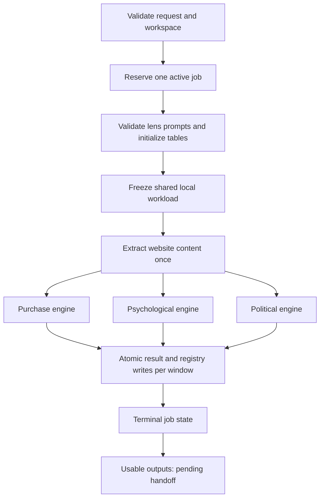

# Profiling engine

[Guide index](README.md)

## Entry points and composition

`api.create_app` serves the browser application and JSON API. `JobManager` owns job admission and execution; `worker.run_job` exposes the same lifecycle synchronously to the CLI. `AnalysisEngine` runs one lens. `ProfilingStore` owns local SQL and pooled connections. Extractors and the Gemini analyzer are injected into the engine, which lets tests exercise the pipeline without network access.

The three lenses are frozen declarations: purchase drivers (why people buy), psychological/behavioral attributes, and political/sociological audience attributes. They supply a name, token, seed attributes, a system-prompt template, and optional output-schema additions. Their output is a model-derived description, not independently verified demographic truth. Purchase includes additional structured output such as `gravity_band`.

## Job flow

Only requested lenses run. The manager allows one active job, but that job may run several lens engines concurrently. They share a token-bucket rate limiter and abort controller. Preparation runs on the worker thread, so submission returns promptly. A job is not a durable distributed queue: active jobs belong to the process, while JSON records and handoff milestones provide selected persistence.

## Workload selection

The workload reads `profiling_source.websites_enriched`, joined through URL mapping to known companies. It excludes URLs already present in each relevant workspace/lens result table. One frozen shared workload and one extraction pass are reused across requested lenses; each engine filters out URLs already completed for its own lens.

`features_formatter.py` parses JSONB features into cleaned description plus structured metadata. Body extraction falls back from body to `kycDescription` to title. Boilerplate cleaning handles multilingual navigation/accessibility text, markdown/HTML remnants, Unicode normalization, and control/zero-width characters. Its regex cleaner is an intentional adaptation from the heavier Topics dependencies.

Duplicate URLs are dropped. Non-dictionary feature values are skipped. A body shorter than the engine's ten-character minimum is skipped only if there is no useful metadata. Thus metadata-only sites can still be analyzed. Limited randomized selection samples a bounded oversupply (3× limit, capped at 10,000) rather than sorting the entire source randomly.

The store streams the workload query through a server-side cursor while holding its transaction-scoped source reader lock. The prepared job workload is subsequently held in memory. Query cancellation uses psycopg's cross-thread cancellation path.

## Extraction choices

| Tier | Implementation | Behavior |
|---|---|---|
| 0 | Stored feature body | Fallback when live extraction is absent or unusable |
| 1 | httpx + trafilatura | Static fetch, per-domain pacing, bounded concurrency, cleaning and content checks |
| 3 | Self-hosted Firecrawl REST | Bounded concurrent `/v1/scrape` calls, normalized URLs, response checks |

The configured backend is selected; these are not an automatic tier-1-then-tier-3 cascade. Playwright tier 2 and Exa are excluded from this implementation. The Firecrawl container stack may internally use its own Playwright service, which is different from a profiling tier-2 backend.

Tier 1 uses per-domain locks with a two-second delay, a 15-second HTTP timeout, two transport attempts, and a single-worker trafilatura executor to avoid unsafe wide libxml2 concurrency. Extracted text must pass the shared minimum-content checks (150 characters), MIME/empty-body checks, and soft-404 detection. Cancellation is checked per URL. Failure normally falls back to tier 0; `exclude_failed_extraction` instead removes those sites.

## Analysis and registry evolution

Each lens engine initializes result and attribute tables, loads its registry, and seeds missing attributes. The prompt must contain `{current_attributes}` exactly once, no unknown format fields, and survive a formatting round trip. Seeds are case-insensitively deduplicated and bounded.

Default run options are confidence 0.8, registry capacity 300, fuzzy similarity threshold 80, window size 2 to 20, up to 16 Gemini workers, and 60 requests/minute. The source default model is `gemini-3.1-flash-lite-preview` with medium thinking. These are repository defaults, not a live check of provider models or pricing.

Windows let concurrent model calls share a stable registry view. While the registry is stable the window doubles up to the maximum; a registry already at least half full starts at the maximum. A successful window persists result rows and its attribute additions/deletions/statistics in one transaction. Previously completed windows survive a later failure.

Registry logic uses case-insensitive keys, exact-match then fuzzy `thefuzz.ratio` matching, and a confidence gate for new attributes. At capacity it evicts the lowest `use_count * avg_confidence` score. Seeds begin with usage 5 and average confidence 0.9. Prompt attributes are usage-ranked and bounded, with disclosure when others are omitted.

Per-job numeric overrides take precedence over saved runtime settings, which take precedence over environment defaults. The five UI-editable settings are confidence, registry capacity, similarity threshold, request rate, and randomized selection. Saved settings live in engine state JSON; editing them does not rewrite the secret-bearing `.env` file. Randomization has no per-job form override.

## Gemini and failures

`gemini.py` constructs a structured response schema, adds lens-specific fields, and parses profiles plus a summary. It tracks input, cached-input, output, and thinking usage and calculated cost. Truncated JSON has a bounded repair path; blocked, empty, malformed, or still-truncated responses become explicit errors.

Retryable quota/resource-exhaustion failures have bounded exponential retry (five attempts, 10–120-second waits). Daily-quota exhaustion is a hard stop, not a retry loop. The shared abort controller wakes rate-limit waiters and stops sibling lenses. The engine also aborts after ten consecutive processing errors or when every attempted website failed.

Job outcomes distinguish clean completion, `completed_with_errors`, failure, and cancellation. Partial lens outputs are retained; the synchronous worker exits nonzero for partial, failed, or cancelled work. Jobs write atomic per-job JSON snapshots on transitions and maintain bounded history. The source includes separate durable handoff milestones because ordinary in-memory job availability does not survive all restarts.

## Storage and handoff semantics

`ProfilingStore` opens a psycopg pool with a bounded readiness wait. Borrowed connections commit on success, roll back on failure, and return to the pool. `persist_results_and_attribute_changes` inserts results and registry changes atomically; URL conflicts do not overwrite previous result rows.

Local workspace tables accumulate across jobs. The handoff names the usable output **tables**, not an immutable row set unique to one job. When the person later chooses Copy now, the publisher streams those tables. See [handoff details](06-handoff-export-and-evidence.md) for publication, retries, and restart state.

Source: `jobs.py`, `engine.py`, `storage.py`, `registry.py`, `workspace.py`, `lenses/`, `extraction/`, `gemini.py`, `runtime_settings.py` in [source reference](10-source-reference.md).
