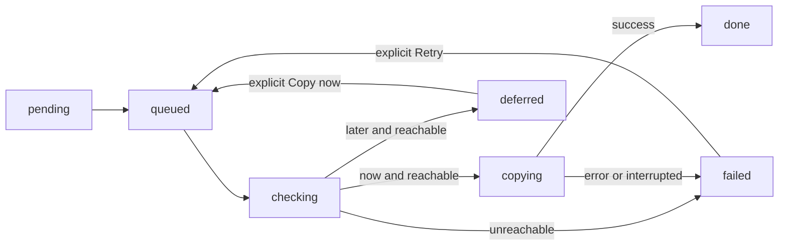

# Handoff, export, and evidence

[Guide index](README.md)

## Profiling-to-serving handoff

The engines exchange data through RDS table contracts, not local cross-engine reads. After a profiling job has usable output tables, its handoff becomes `pending`. The person chooses **Copy now** or **Later** from the browser. Both choices initiate a bounded connectivity check; Later records `deferred` only if that check succeeds. It does not schedule a future copy.

Jobs without usable outputs have `not_applicable` handoffs. The manager validates transitions; another Copy now for `done` is refused. Checks/copies run on daemon threads, keeping API requests responsive. The usual reachability bound is five seconds, with lower configured connection bounds respected. Abandoning a timed-out probe is not equivalent to forcibly cancelling a network thread; late sessions close themselves.

The publisher uses separate `PROFILING_PUBLISH_PG_*` credentials and a profiling-owned lazy pool. None configured yields a disabled publisher with a clear error; partial configuration reports missing variable names before connecting. The intended remote role has privileges to create/fill tables in the existing `profiling` schema and temporary tables in the database.

`data-transfer/publish.py` restricts destination schema, identifier length/shape, supported type syntax, and a fixed SQL statement set. Names are composed as identifiers and row bytes travel through COPY. For **each table**, it creates the destination if absent with the source column names/types, copies into a transaction-local temporary table, and inserts with `ON CONFLICT (accessed_url) DO NOTHING`. Existing compatible columns are addressed by name, even if their order differs. Incompatible targets fail instead of silently misfiling data.

Each table is its own transaction. A multi-lens handoff is not one all-or-nothing cross-table transaction; successful earlier table copies can remain after a later table fails. Retry is safe at the URL-conflict boundary and inserts only new URLs. It is append-only publication: it neither overwrites an existing URL's analysis nor propagates deletions. It does not preserve all local defaults, indexes, or constraints as a general database clone.

Workspace result tables can span several jobs. A deferred handoff streams the named tables when executed, not a frozen per-job row subset. After publication, serving sees those results only on a later explicit bootstrap/refresh, when its profiles resolver chooses the table and copies it into a new local vintage.

Handoff transitions also persist in `profiling/handoff-milestones.json`, with an audit log. Restarted processes expose outstanding detached entries through the Hand-offs panel; interrupted copies become retryable failures. A late commit after clean shutdown is disclosed rather than represented as a rollback. No startup copy or timer retry is implied.

## Serving/export orchestration

The shared serving run rail is `preflight → export → snapshot (when evidence is enabled) → publish (optional Neo4j) → finalize`. Preflight checks required configuration by name, local availability, and active revision consistency. A stage failure is recorded on the run; cooperative cancellation and durable terminal states are distinct outcomes.

`run_serve` writes bare ranked identities. `run_export` adds contacts and spend, with a single shared-reader hold across serving/export. It deduplicates requested sellers in their original order, builds the vintage and optional guard, and dispatches each seller to warm or day-zero/cold logic.

Details, spend, and suppression are fetched through three parallel read-only local sessions. The reader lock prevents vintage promotion beneath those reads. Spend prefers copied `buyers_enriched`; if absent, it uses derived `parent_spend`. The chosen source is recorded.

## Contact selection and suppression

The export groups records by parent, then chooses `primary` when an email exists and `is_business` is not true, `relaxed` when any email exists, or `phone_only` when no record has an email. The last tier name reflects the upstream contact-data assumption; the picker itself does not validate that a phone is present. Within a tier, the preference key favors private records, newer enrichment/update timestamps, and finally the lowest ID. These predicates live in `export.pick_best_record` and are covered by `test_export_rows.py`.

Email normalization strips surrounding whitespace and lowercases; empty strings become absent. Suppression checks all known emails for a parent against the target seller's existing-customer email set, not just the selected email. Within a seller, duplicate exported email addresses keep the highest-ranked candidate. These operations can reduce exported rows below the serving quota; export counts distinguish served, matched, suppressed, duplicate, and exported.

CSV output contains seller/rank/parent IDs, score and percent-rank, lane, contact fields, spend fields, and contact grade. Decimal and datetime values use raw cursor values rather than a pandas conversion. `csv_text_guard` neutralizes spreadsheet formula-leading text while retaining dialable phone-shaped values. This is output safety in the writer, not merely UI escaping.

## Publication boundary

Cancellation is checked between sellers and once immediately before the publication unit. Inside that unit it is masked: evidence commits first, then the CSV lands by temporary-file replacement. Post-barrier event callback errors do not turn a successful publication into a cancelled/failed outcome.

PostgreSQL evidence and filesystem CSV are **not** one distributed transaction. A filesystem failure after evidence commit can leave the latest evidence generation newer than the available CSV. Run status and persisted snapshot metadata must therefore govern what a historical page exposes; merely finding a latest evidence table is insufficient proof of a completed run.

## Receipts and historical snapshots

Warm receipts recompute contribution terms with the same CF functions used for ranking. Before writing, the sum must match the served score at relative tolerance `1e-9`. The display retains up to five contributing shops per prospect with contribution, share, and co-buyer evidence.

Cold and day-zero receipts describe shared tags. They do not claim shared buyers with the target. Oracles check the tag-sharing purchase count against the score and reconcile SQL sharing with the attribute-matrix sharing set. Unknown lane prefixes fail instead of receiving misleading receipts.

`evidence.py` atomically rebuilds four tables in `serving_evidence`: run information, prospects, memberships, and evidence links. These tables represent the latest generation, not historical storage. `studio/snapshot.py` therefore reads one consistent evidence generation under read-only REPEATABLE READ and writes bounded per-seller audience JSON into the run directory. Identity, summaries, and labels are decorated separately and best-effort. The run's saved snapshot metadata is the visibility barrier; older pages do not reread the newest evidence as if it belonged to the old run.

The displayed graph uses actual shop-sharing/evidence and purchase links. A prediction that a person is a prospect for the target is not drawn as an observed purchase edge.

## Neo4j projection

`graph.py` is the only writer of the local evidence graph. Explicit publication wipes only its five owned labels (relationships first, then nodes), creates key constraints, and loads prospects, memberships, then evidence links using batched UNWIND/MERGE. Model documents are embedded in the module. It does not own arbitrary Neo4j labels or use the graph as the runtime recommender database.

Six checks report node counts, relationship arithmetic, orphans, run identity, receipt reconciliation/completeness, and shared-parent invariance. A graph load/wipe/check is a staged operation, not an atomic swap of the entire Neo4j projection; run results must disclose publication failures. Source evidence and CSVs have their own state.

Source: profiling `handoff.py`, transfer `publish.py`, serving `export.py`, `runner.py`, `evidence.py`, `graph.py`, and `studio/snapshot.py` in [source reference](10-source-reference.md).
